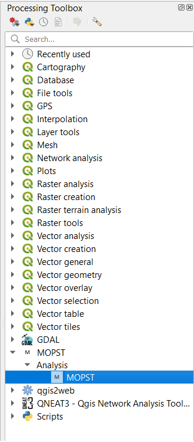
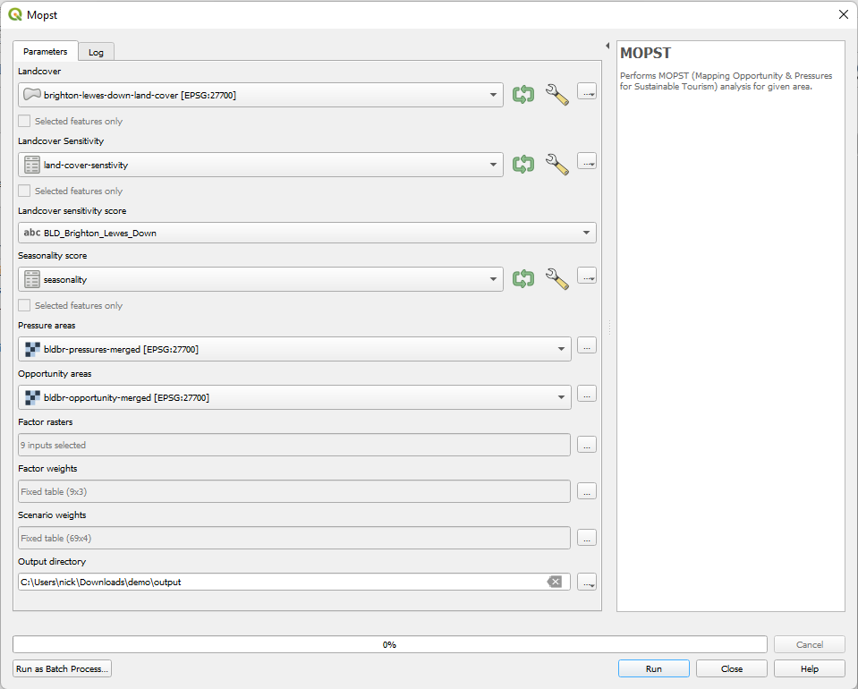

## Demonstration Files

The [`demo.zip`](https://github.com/mopst/qgis-plugin/releases/download/v1.0.0/demo.zip) file contains some example files to show how the tool works. You can use these files to verify if the Toolbox is working properly on your machine. 

### Requirements

This needs **QGIS 3.22** or greater to run.

This has been tested on QGIS 3.22 and should work on later versions of QGIS (it has also been tested on 3.30). It may also work on earlier versions of QGIS (3.x) but this has not been tested. *Please let us know if it works for you*. 

### Video

This [video](https://youtu.be/oK67PIRi64o) shows how to use the tool and the demo files. Step-by-step instructions are below. 
 
 
### Step by step instructions

#### Install Plugin

*This is a temporary process until the plugin is stored in the QGIS Python Plugins Repository.*

- Download the [MOPST QGIS Plugin](https://github.com/mopst/qgis-plugin/archive/refs/tags/v1.0.0.zip). Save this somewhere on your machine you can find it (e.g. Downloads). 

- Extract the `qgis-plugin-1.0.0.zip` file in to somewhere you can find it (e.g. Downloads). 

- Locate your QGIS Plugins folder. Typically this is in your user profile, e.g. `C:\Users\USER\AppData\Roaming\QGIS\QGIS3\profiles\default\python\plugins` on Windows. 

Alternatively you can go **Settings -> User profiles -> Open active profile folder** in QGIS. From there, you can go to `python -> plugins`. That's the plugin folder for QGIS v3.

On a Mac it will look like this: `~/Library/Application\Support/QGIS/QGIS3/profiles/default/python/plugins`

On Unix it will look like this `/home/USER/.local/share/QGIS/QGIS3/profiles/default/python/plugins`

For more details, please checkout this post on [StackExchange](https://gis.stackexchange.com/questions/274311/qgis-3-plugin-folder-location).

#### Run Plugin with Demo files

- Open QGIS.

- You can verify the plugin is there by opening the Processing Toolbox (**Processing > Toolbox**) and check MOPST is listed:

- Download the [`demo.zip`](https://github.com/mopst/qgis-plugin/releases/download/v1.0.0/demo.zip) file and extract it. This contains all the files you need to run the Plugin. 

The input files (from `demo.zip`) are:

Name (Format) | Example Filename | Description
-- | -- | -- 
Land Cover (Shapefile) | *brighton-lewes-down-land-cover.shp* | Shapefile of the different land cover types. 
Land Cover Sensitivity (CSV File) | *land-cover-sensitivity.csv* | Sensitivity score for each land cover type.
Seasonality Score (CSV File) | *seasonality.csv* | Contains information on which land cover types are more sensitive in summer or winter. 
Pressure Raster Layer (Raster TIF) | *bldbr-pressures-merged.tif* | Identify the stakeholder identification of areas of tourism pressure. 
Opportunity Raster Layer (Raster TIF) | *bldbr-opportunity-merged.tif* | identify the stakeholder identification of areas of tourism opportunity. 
Factor Weights (CSV File) | *seasonality.csv* | Lists all of the Factor Raster Layers and the weights given to them for Pressure and Opportunity.
Scenario Weights (CSV File) | *scenario-weights.csv* | lists the three scenarios (Profit, Business as usual, Custodianship) and their weights. 
Factor Raster Layers (Raster TIF) | *factor-rasters* | show the presence (**1**) or absence (**0**) of a range of factors. 

The `factor-rasters` folder contains 9 example factors. These are all created using open source data and therefore are free to distribute. © OpenStreetMap contributors. 

- Open the `demo-project.qgz` file. 

- In the Processing Toolbox, navigate **MOPST > Analysis > MOPST**. 
- Set the input files like this:

- Click **OK** to run the model.

- Wait for model to run (about 2 minutes or so). 

These data took 2 minutes 5 seconds to run on my machine. Your computer might be quicker or slower, but it should be around this figure. 

- Check the outputs in whichever output directory you chose. 

- Compare these and the output log to the files available in the [output.zip](https://github.com/mopst/qgis-plugin/releases/download/v1.0.0/output.zip) file. 

- Adjust the weights and re-run the model to see how the output varies.

For more details, please look at the [video](https://youtu.be/oK67PIRi64o).

